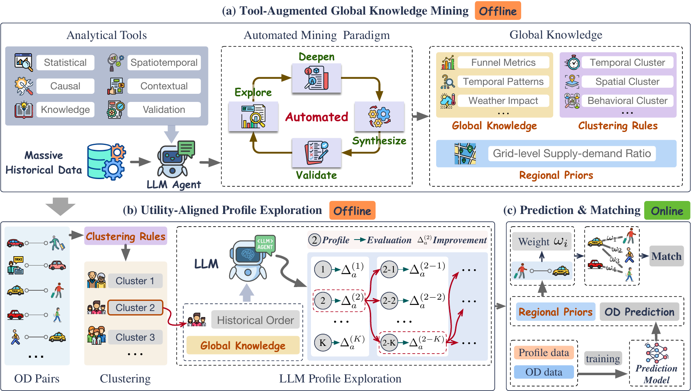

# ProfiLLM: Utility-Aligned Agentic User Profiling for Industrial Ride-Hailing Dispatch

> **ProfiLLM: Utility-Aligned Agentic User Profiling for Industrial Ride-Hailing Dispatch**
> Tengfei Lyu\* , Zirui Yuan\* , Xu Liu, Kai Wan, Zihao Lu, Li Ma, Hao Liu†
> *HKUST(GZ)* (Tengfei Lyu, Zirui Yuan, Hao Liu) and *DiDi Chuxing (Didichuxing Co. Ltd)* (Xu Liu, Kai Wan, Zihao Lu, Li Ma)
> Under submission to **VLDB**, Scalable Data Science track. Deployed on DiDi's production dispatcher.
>
> \* Equal contribution. † Corresponding author.

<p align="center">
  <a href="https://profillm.github.io"></a>
  <a href="https://profillm.github.io/files/ProfiLLM_paper.pdf"></a>
  <a href="https://profillm.github.io/files/ProfiLLM_appendix.pdf"></a>
  <a href="#citation"></a>
</p>

**Links / Resources**

- Project page (full appendix, interactive): https://profillm.github.io
- Paper (PDF): https://profillm.github.io/files/ProfiLLM_paper.pdf
- Online HTML appendix: https://profillm.github.io/appendix.html
- Appendix (PDF): https://profillm.github.io/files/ProfiLLM_appendix.pdf

## 📰 News

- **Jun 2026** The project page and the full appendix (Sections A through Q) are now online at [profillm.github.io](https://profillm.github.io), with an interactive [HTML appendix](https://profillm.github.io/appendix.html).
- **Jun 2026** The code and data are under enterprise review at DiDi and will be released upon approval. Please star ⭐ this repo for updates.

## Overview

ProfiLLM is a practical framework that turns platform-scale ride-hailing behavioral logs into utility-aligned, cluster-level user profiles, improving order-outcome prediction inside a production dispatcher while keeping all LLM inference offline. It is built from two synergistic modules.

- **Tool-Augmented Global Knowledge Mining.** An LLM agent equipped with 27 composable analytical tools mines platform-scale logs under an Explore → Deepen → Validate → Synthesize paradigm, producing global knowledge, adaptive user-clustering rules, and regional supply–demand priors.
- **Utility-Aligned Profile Exploration.** Per cluster, the agent generates K candidate profiles, scores each with a lightweight LOGIC-rule utility proxy (λ-blended with the base predictor), iteratively refines the best candidate, and assembles preference pairs for DPO fine-tuning of a single-pass profile generator.

A strict offline–online contract keeps all LLM reasoning offline. Online serving reduces to a deterministic cluster-rule lookup plus a cached cluster-embedding fetch with sub-millisecond overhead and **zero online LLM inference**, comfortably within DiDi's roughly 200 ms (2-second) dispatch budget.

<p align="center">
  
</p>

## Key Results

| Metric | Result |
|---|---|
| Order-outcome prediction AUC | up to **+6.14%** (relative, over a structured-only baseline) |
| Dispatching-simulation GMV | up to **+4.35%** |
| 14-day online A/B (City A), GMV | **+0.47%** |
| 14-day online A/B (City A), Completion Rate (CR) | **+0.33%** |
| 14-day online A/B (City A), Cancel-Before-Accept (CBA) | **−0.82%** |
| Added online latency | **< 0.01 ms** per OD pair |
| Offline refresh cost (with DPO) | **10.6×** cheaper |
| Profile compression | **96** cluster profiles cover all **348,464** City-A users (~3,630× fewer than per-user profiling) |

Results are reported across three cities, and ProfiLLM is deployed on DiDi's production dispatcher.

## Project Page & Appendix

Reviewers and readers are encouraged to start at the [project page](https://profillm.github.io), which hosts an interactive [HTML appendix](https://profillm.github.io/appendix.html) (also available as a [PDF](https://profillm.github.io/files/ProfiLLM_appendix.pdf)). Selected highlights with deep links:

- [A. Empirical Motivation: User Behavioral Heterogeneity](https://profillm.github.io/appendix.html#heterogeneity) (variance attributable to stable user-level traits invisible to structured features)
- [B. Representative Case Studies](https://profillm.github.io/appendix.html#case-studies) (what the profile embeddings capture)
- [K. Utility-Proxy Sensitivity to the Blending Coefficient λ](https://profillm.github.io/appendix.html#lambda) (grid search across cluster granularities and tasks)
- [L. DPO vs. Exploration: Why Both Variants Help](https://profillm.github.io/appendix.html#dpo-vs-exploration)
- [M. Offline System Cost Analysis](https://profillm.github.io/appendix.html#offline-cost) (end-to-end cost of refreshing a city)
- [O. Extended 14-day A/B Test: Long-term Stability](https://profillm.github.io/appendix.html#extended-ab)
- [P. Privacy and Fairness Considerations](https://profillm.github.io/appendix.html#privacy-fairness)
- [Q. Prompt Template](https://profillm.github.io/appendix.html#prompts)

## Code & Data Availability

> 🚧 **Under enterprise review.** The code and data are currently under internal review at DiDi and will be released here upon approval. Please stay tuned and star ⭐ this repo to be notified.

**Data / IP note.** To comply with enterprise data-governance and privacy policy, the real ride-hailing data and proprietary system details (user, driver, and order identifiers, GPS traces, internal feature schemas, trained weights, service endpoints, and deployment scripts) cannot be released. Upon approval, the release will convey the method and interfaces only, with anonymized feature names, so that users can supply their own data files matching the documented input formats. The published experimental results were produced on internal infrastructure that is not part of any code release.

## Citation

If you find this work useful, please cite:

```bibtex
@article{lyu2027profillm,
  title   = {{ProfiLLM}: Utility-Aligned Agentic User Profiling for Industrial Ride-Hailing Dispatch},
  author  = {Lyu, Tengfei and Yuan, Zirui and Liu, Xu and Wan, Kai and Lu, Zihao and Ma, Li and Liu, Hao},
  year    = {2026},
  note    = {Under submission to PVLDB (Scalable Data Science)},
  url     = {https://profillm.github.io}
}
```

## Contact

- Tengfei Lyu — tlyu077@connect.hkust-gz.edu.cn
- Zirui Yuan — zyuan779@connect.hkust-gz.edu.cn
- Hao Liu (corresponding author) — liuh@ust.hk

## License

The code release will be accompanied by an open-source license, finalized at release time pending internal approval.
